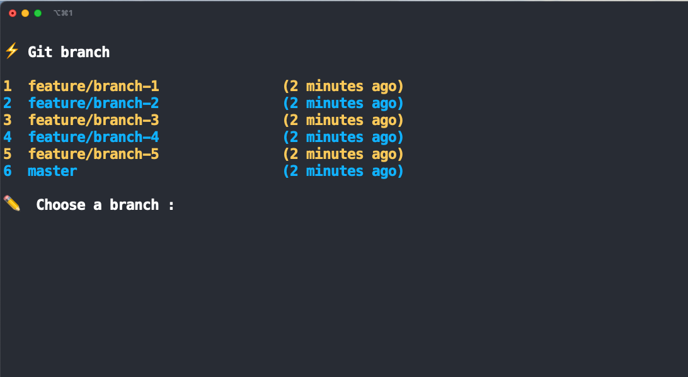

# git-branch

`gb` is your friendly tool to easily switch between branches in your git repository. You can also view theirs, manage and get more control!

## Installation

The tool is available for all platforms (Linux, macOS, Windows) on this [page](https://github.com/Tchoupinax/git-branch/releases). You can also use your favorite package manager to easily install and update `git-branch`.

### Linux

```
curl https://raw.githubusercontent.com/Tchoupinax/git-branch/master/scripts/installation-linux.sh | bash
```

### macOS

```
brew tap tchoupinax/brew
brew install tchoupinax/brew/gb
```

## Usage

Go in a git repository and type `gb` :).

The list of all branches will appear, you can then swith to one by typing the number at the start of the line.

Also, you can provide the number of the branch directly

```bash
gb $number
```



## Development

```
npx nodemon -e go  --exec "go build -o main *.go || exit 1"
---
main
```

https://github.com/reinhrst/fzf-lib
